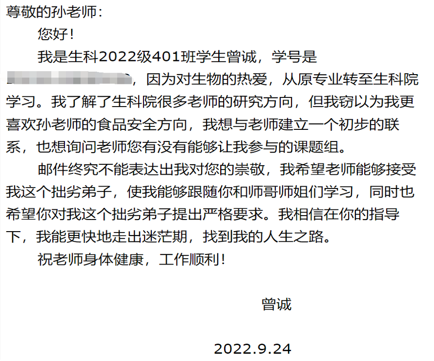
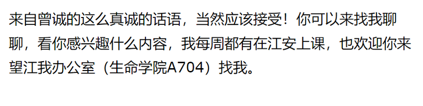

# 如何找到老师/沟通

作者：曾诚

关于科研问题，更多的是考验同学们的与人交流沟通，把握机会的能力。拿我自身来说吧，我刚转过来的时候对于生科的东西几乎可以说是一概不知，但是我愿意去给导师发邮件，与导师约时间线下见面，大多数导师都愿意给同学们提供进实验室的机会，包括但不限于你们的班主任、任课老师，可以去学院的官网教职工页面去寻找自己感兴趣的导师，给ta发邮件，不过导师很忙，所以沟通时不要弯弯绕绕，一定要直接表达清楚自己的意思，但也不要让别人感觉到冒犯。至于大创这个问题，大一的同学可以先不用着急，先把第一学年的专业课学好。

下面是我给孙群老师发的邮件和孙群老师给我的回复，可以参考一下。

因为孙老师接纳了我，所以我在科研上有一些进展，我有一个国家级的大创，还认识了很多优秀的师兄师姐。