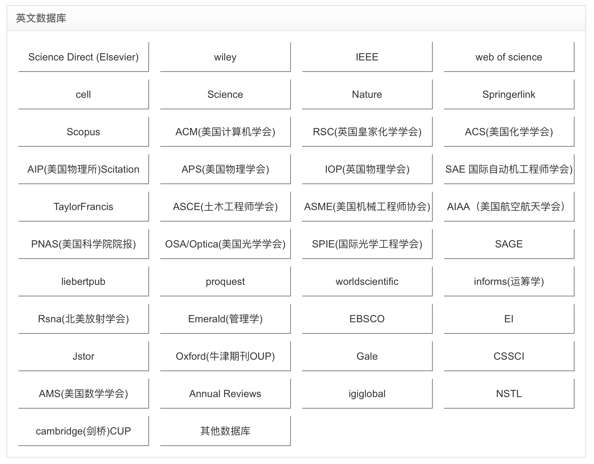

论文期刊是学术或专业领域内的定期出版物，它们通常包含由研究人员提交的原始研究、综述或其他相关文章；这一步主要涉及到论文期刊，例如Nature Neuroscience等。出版则是这一过程的最终阶段，指将收录的论文准备成最终的格式并通过各种渠道（如印刷或在线）使其研究机构可用；这一步涉及到出版商，例如Springer Nature、Elsevier等。

当我们搜索论文时，为了保证阅读的论文质量，我们一般选择一些大期刊的论文进行下载与阅读。

# 论文搜索

## 综合搜索

综合搜索指的是利用关键词搜索后得到不同期刊的论文结果。

主要使用的是：[Google Scholar](https://scholar.google.com)

这是一个基于谷歌服务的网站，其网络连接在国内并不稳定。因此，可以使用谷歌学术(Google Scholar)的镜像网站：[Google Scholar - 镜像](https://ac.scmor.com)

除了谷歌学术，我们还可以使用国内的综合搜索网站，例如：[百度学术](https://xueshu.baidu.com)

## 特定网站搜索

除了对论文进行综合搜索，我们还可以对特定期刊或出版商的发行论文进行搜索。

一下是常见出版社与期刊及其对应领域简介：

1. **Elsevier**：
   - *Cell*：覆盖细胞生物学的广泛领域。
   - *Gene*：遗传学、分子生物学。
   - *Journal of Molecular Biology*：分子生物学、生物化学。
   - *Pharmacology & Therapeutics*：药理学和治疗学。
   - *Neuroscience*：神经科学领域。
2. **Springer Nature**：
   - *Nature*：跨学科，发布各个领域的突破性研究。
   - *Nature Genetics*：遗传学。
   - *Nature Cell Biology*：细胞生物学。
   - *Nature Biotechnology*：生物技术、应用生物学。
   - *Nature Reviews Molecular Cell Biology*：分子和细胞生物学的综述文章。
3. **Wiley**：
   - *EMBO Journal*：分子生物学。
   - *Journal of Cellular Biochemistry*：细胞生物化学。
   - *Molecular Ecology*：分子生态学。
   - *The Plant Journal*：植物科学。
4. **Cell Press (Elsevier 子公司)**：
   - *Developmental Cell*：发育生物学。
   - *Cell Metabolism*：细胞代谢。
   - *Cell Stem Cell*：干细胞研究。
5. **Oxford University Press (OUP)**：
   - *Bioinformatics*：生物信息学、计算生物学。
   - *Molecular Biology and Evolution*：分子生物学和进化。
   - *Nucleic Acids Research*：核酸研究，包括DNA和RNA。
6. **Cambridge University Press**：
   - *Parasitology*：寄生虫学。
   - *Insect Molecular Biology*：昆虫的分子生物学。
   - *Zoological Journal of the Linnean Society*：动物学和分类学。
7. **Public Library of Science (PLOS)**：
   - *PLOS Biology*：生物学的各个领域。
   - *PLOS Genetics*：遗传学。
   - *PLOS Pathogens*：病原体和宿主互作。
8. **American Society for Microbiology (ASM)**：
   - *Journal of Bacteriology*：细菌学。
   - *Molecular and Cellular Biology*：分子和细胞生物学。
   - *Journal of Virology*：病毒学。

对应网站只需要在搜索引擎搜索关键词即可

# 论文下载

论文一般都需要付费下载，以下介绍两种免费下载论文的方式。

## 川大网站下载

通常来说，一所大学会购买某些出版机构的部分期刊论文，在校学生可以通过登陆所在大学账号的方式来免费下载。

四川大学提供了：

* 知网、万方、维普等中文期刊
* 本校同学发布的学位论文
* web of science
* SCI
* EBSCO
* SpringerLink
* JSTOR
* EI

利用学校账号登陆这些网站时，必须通过[校外访问](http://182.150.59.104:8888/login)访问

## 第三方网站

当需要下载论文不免费提供，并且不包含在学校购买的数据库中，我们可以采用第三方网站的方式进行下载。

最常使用的网站是Sci-Hub:

Sci-Hub是一个影子图书馆。它利用不同方法绕过出版商的付费墙，以不考虑著作权问题的方式提供数以百万计的学术论文和著作。其创始人为哈萨克研究生亚历山德拉·埃尔巴金。

Sci-Hub数据库收集了 88,343,822 份研究文件，全部免费下载。大约80%的文件是发表在期刊上的研究论文 6%是会议论文集（conference proceedings）中的论文，5%是书籍的章节 剩下的就是其他种类的文件了。Sci-Hub上能查询到的文件中，77%发表于1980年到2020年 36%发表于2010年到2020年。所有主要科学出版社的覆盖率都在95%以上。Sci-Hub数据库的总规模约为100TB。

这是Sci-Hub的官方镜像网站：[Sci-Hub - 镜像](https://sci-hub.se/mirrors)

可以通过论文名称与DOI号搜索与下载。

---

当论文既不在学校购买的数据库中，又不包含在Sci-Hub中时，还有一种终极方式。

上文提到各个学校都会购买出版机构的部分期刊论文，假如能够综合大部分学校购买的论文，那不就几乎含括了所有论文了嘛。

基于上述理论，我推荐一个允许访问绝大部分学校资料库的网站：[论文下载网](http://www.lunwenxiazai.com)

这个网站允许访问绝大部分的期刊论文：

## Zotero插件下载

这个功能需要安装Zotero Connector浏览器插件。在对应的文献查阅网页，你可以直接将这一篇文献下载到Zotero中，自动收集信息并形成条目。并且值得注意的是，这一项功能并不需要你登陆任何账号，支持Google scholar，知网以及所有主流杂志期刊出版商网站。

具体内容请查看[文献管理与阅读](../软件与工具/文献阅读与管理.md)

## 总结

数据库包含数量：

论文下载网>>Zotero插件>Sci-Hub>四川大学数据库

推荐：

先使用Zotero插件下载，再使用Sci-Hub，再使用论文下载网