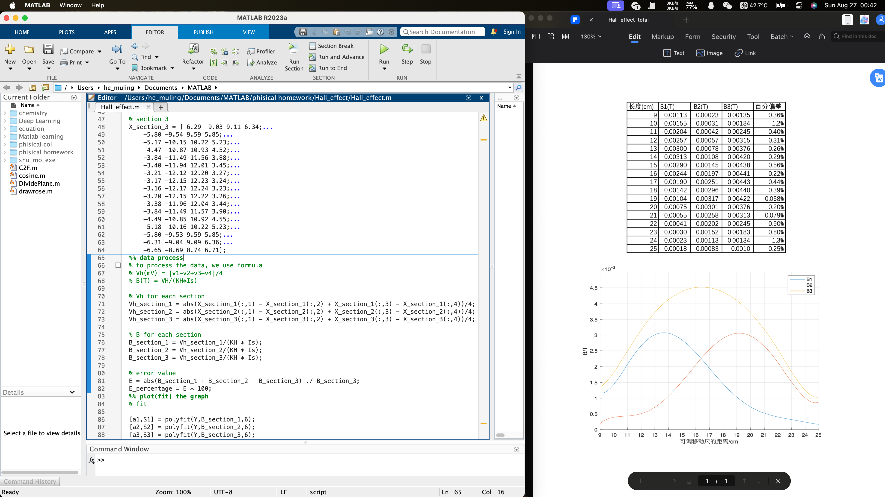
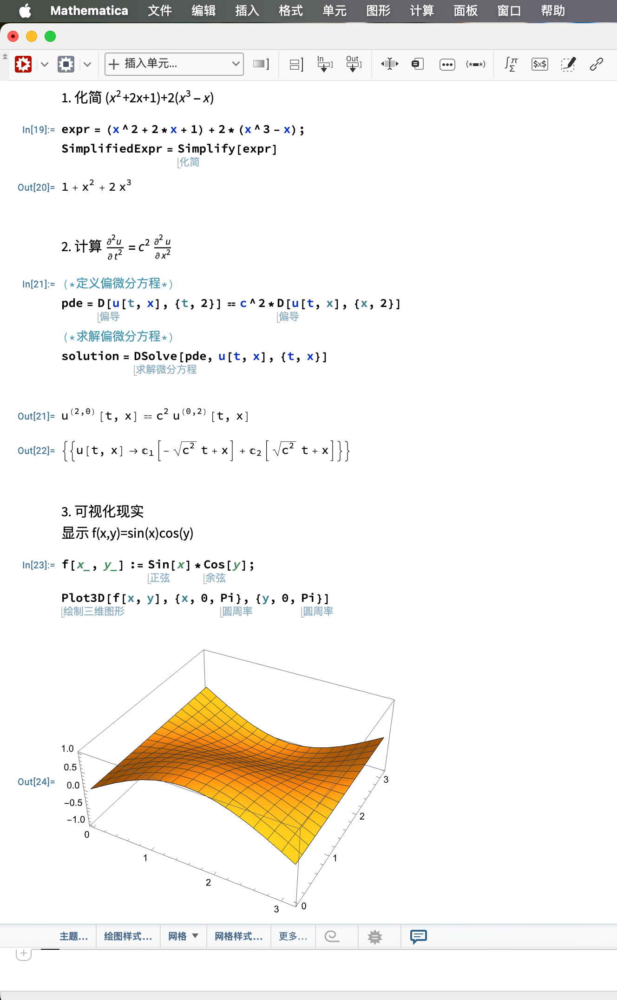

进入大学后，新接触到的内容包括数据处理与科学计算。通常来说，简单的数据处理与科学计算可以通过单纯地按计算器解决，但对于大量数据、复杂的情况或是重复的计算，使用合适的软件是一个更优解。因此，这一章节将简要的接受有关数据处理与科学计算的相关软件。

# 数据处理

数据处理在本科阶段比较少见，但在物理实验以及部分化学实验时，也会涉及到。例如物理实验中不确定度的计算，以及对实验测量数据的处理与拟合等。虽然靠手也能完成，但像不确定度计算这种把大量数据代入到相同算式中进行复杂运算、并且要保留不同位数小数的，以及需要对数据进行拟合的，都具有较高的难度（指过于麻烦）。因此，使用代码进行数据是一种降低难度的做法。当代码构建完成后，对于不确定度这一类公式相同的计算，只需要输入测得的数据即可以完成计算；而对于数据的拟合，则可以依靠软件自带的工具之间进行绘图。

## Matlab

**Matlab**: macOS, Windows, 学生价格55USD

官网：[mathworks.cn](https://ww2.mathworks.cn/products/matlab.html)

教程：[MATLAB教程_台大郭彦甫-bilibili](https://www.bilibili.com/video/BV1GJ41137UH/?spm_id_from=333.999.0.0&vd_source=1acd39a490f2da4a91d229f458c75e7a)

Matlab是一种用于算法开发、数据可视化、数据分析以及数值计算的高级技术计算语言和交互式环境。除矩阵运算、绘制函数/数据图像等常用功能外，MATLAB还可用来创建用户界面，以及调用其它语言（包括C、C++、Java、Python、FORTRAN）编写的程序。

在数据处理中，我们常常使用矩阵运算（几乎不需要线性代数的知识）、画图以及拟合的功能。以下是一个利用Matlab进行数据处理的实例。这是一个关于霍尔效应的物理实验，需要根据测量到的大量数据进行计算，获得新的数据后进行拟合并绘图：

上图左边为代码部分，右边为最终的结果：右上方的B1,B2,B3为根据实验测量数据计算的结果，右下是根据计算结果进行拟合的绘图。可以发现，本实验需要计算的内容即多，假如每个都使用计算器手算，则是耗时耗力。若采用代码的方式，则只需要输入数据与公式，进行计算即可。

Matlab有以下优点：

1. 支持矩阵运算，可以一次算多个数据
2. 功能强大，可以进行复杂的数学运算（线性代数、统计、傅立叶分析等），可以进行深度学习与机器学习，甚至可以进行生物信息学与基因学的处理（序列分析，基因表达分析，蛋白质结构预测）
3. 语法简单，类似Python

同时，有以下缺点：

1. 贵，55USD
2. 整个程序不简洁，对计算机性能有一定要求
3. 大部分我们需要Matlab做的事Python都能做

## Python

**Python**：macOS, Windows, 开源免费

官网：[python.org](https://www.python.org)

教程：[黑马程序员Python教程-bilibili](https://www.bilibili.com/video/BV1ex411x7Em/?spm_id_from=333.999.0.0&vd_source=1acd39a490f2da4a91d229f458c75e7a)，选python有关的内容看，懂得基础操作就行了，后面深层次的内容要用的时候可以现用现学

Python是一门比较简单的编程语言（而非软件），很适合没有编程经验的初学者学习，且能有效进行数据处理、科学计算与机器学习等工作。Python使用的实例和Matlab几乎一模一样，但是有以下优点：

1. 免费开源
2. 丰富的第三方插件（package）来实现多种功能（例如画图，科学计算，数据处理，文件处理，机器学习等）
3. 对电脑性能要求低

**VScode**: macOS, Windows, Linux, 免费

官网：[code.visualstudio.com](https://code.visualstudio.com)

为了方便地编写、运行python，我们通常会使用第三方软件。其中VScode以开源和及其完善的第三方插件支持而受到广泛好评，因此在这里推荐VScode。

教程：[VSCode搭建Python开发环境(含Python环境搭建)-知乎](https://zhuanlan.zhihu.com/p/165379391)

# 科学计算

## Mathematica

**Mathematica**: macOS, Windows, 75 USD/year

官网：[wolfram.com](https://www.wolfram.com/mathematica/?source=nav)

这里的科学计算主要是高等数学（微积分、线性代数、概率论等）中的数值计算，虽然说可以用笔算，不过有些时候不会或者是懒得算的时候还是得借助软件/计算器进行计算。常规的科学计算器的功能不太完善，例如不能进行符号运算，不能进行偏微分方程求解，不能进行可视化显示等。因此在这里介绍一个解决了以上问题的软件，Mathematica

下面是一个范例

Mathematica有以下优点：

1. 支持符号（未知数x等）运算
2. 支持偏微分方程求解等复杂运算
3. 支持可视化，且可视化图形可以进行交互
4. 对于积分，可以要求给出详细过程（真的很有用，特别是微积分里不会积分的题目可以参考）
