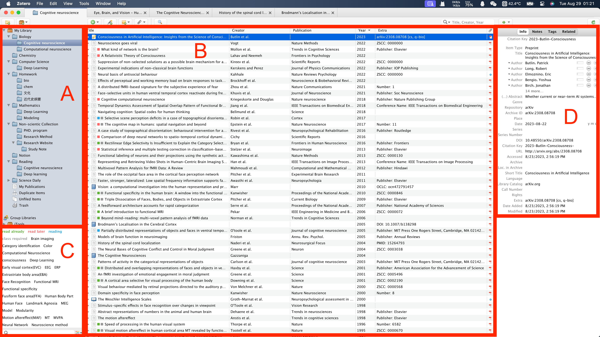

作为生科学生，不管是完成课程作业，进行科研活动，还是为日后的研究生活进行规划，文献阅读都是必不可缺的一项工作。如何科学的阅读文献，对文献进行批注、管理，以便后续论文写作时使用，成为了同学们开始文献阅读时遇到的第一个问题（当然，你的第一个问题也可能是如何搜索/下载自己想要的论文）。

在这一章节，主要推荐一个软件

## 简介

**Zotero**: macOS, Windows, Linux, ios

官网：[zotero.org](https://www.zotero.org)

Zotero是一款自由及开放源代码的文献管理软件，用以管理书目信息（如作者、标题、出版社、摘要、阅读笔记等）及相关材料（如PDF文件）。其最著名的特性是作为浏览器插件、在线同步、与文档编辑软件如Microsoft Word、LibreOffice、OpenOffice.org Writer、NeoOffice等集成，可生成文内引用、生成页面脚注或文后的参考文献（bibliographies）。

## 软件界面

下面是这个软件界面的介绍：

这个界面主要分为左中右三个部分，

左上方（区域A）：这个区域里可以建立多个文件夹，每个文件夹可以代表一个研究领域。在这个文件夹下则会存放这个研究领域的相关论文。

中间（区域B）：这个区域里显示的是某文件夹下存在的，你收集的所有论文（以文献条目的方式呈现）。单机某篇论文会显示右方区域（D），双击某片论文则可以直接打开这篇论文，进入PDF界面，可以直接进行批注、勾画。

左下方（区域C）：Zotero强大的功能之一是可以为每一篇论文添加标签（tag）。这一个文件夹下所有论文的标签会统一显示在左下方，点击标签可以进行筛选（在中间区域显示对应的论文）。单击论文可以在区域D中查看到这一篇论文所对于的标签。

右方（区域D）：这个区域会显示所选论文的相关信息，包括论文名称、论文作者、论文发布的时间、期刊等。同时也会显示对应论文的标签。

## 软件特点

1. 下载文献：

   Zotero有多种导入文献的方式，除了直接的文件导入，还有两个非常强大的功能：元数据抓取与网页抓取。

   元数据抓取：当你将文献PDF拖入Zotero时，会自动根据PDF内容自动抓取对于文献的相关内容，并形成一个文献条目。

   网页抓取：这个功能需要安装Zotero Connector浏览器插件。在对应的文献查阅网页，你可以直接将这一篇文献下载到Zotero中，自动收集信息并形成条目。并且值得注意的是，这一项功能并不需要你登陆任何账号，支持Google scholar，知网以及所有主流杂志期刊出版商网站。

2. 标签：

   Zotero支持对每一篇文献添加标签，这样你可以便捷地对同一研究领域的文献进行更细的分类。这在以后再次查找阅读，进行引用的时候可以起很大的作用。

3. 多平台同步：

   Zotero支持进行网盘备份，并且在本地也会有文件留存。

4. 广泛的第三方插件支持

   Zotero拥有强大的社区以及完善的第三方插件支持。

配置、使用Zotero的教程：[Zotero文献生态-青柠学术微信公众号](https://mp.weixin.qq.com/mp/appmsgalbum?action=getalbum&album_id=1319074508795641857&__biz=MzAxNzgyMDg0MQ==&scene=21#wechat_redirect)

