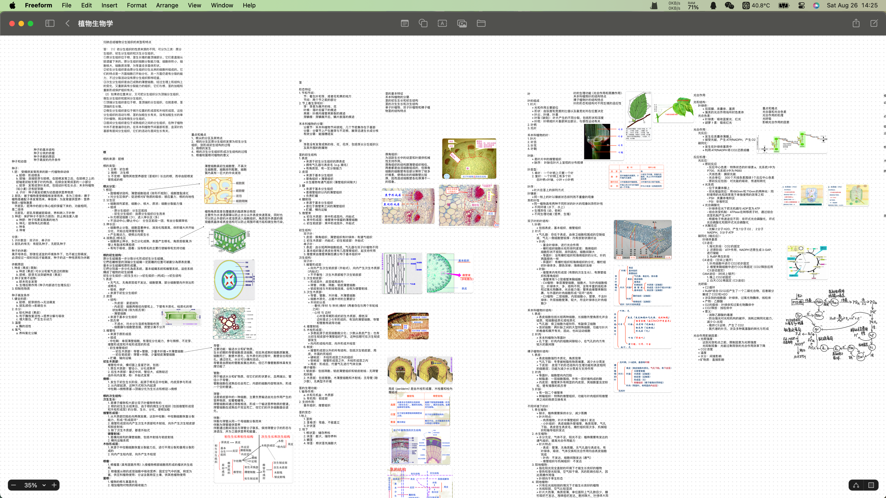
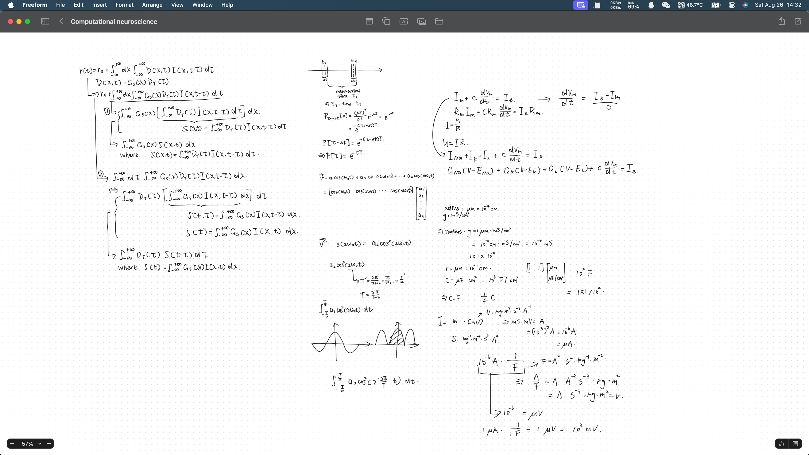
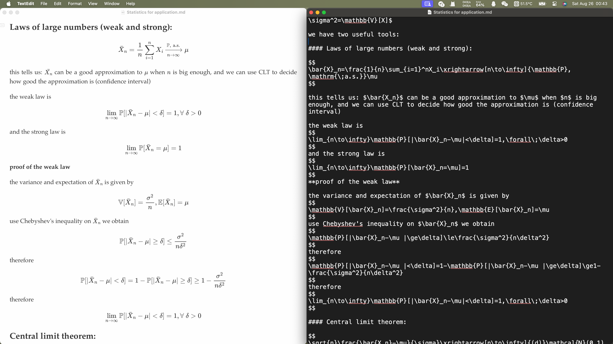
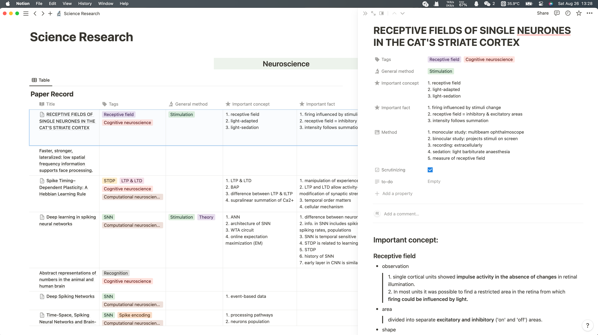
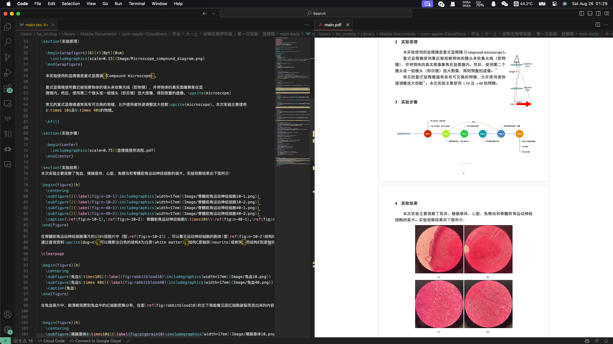
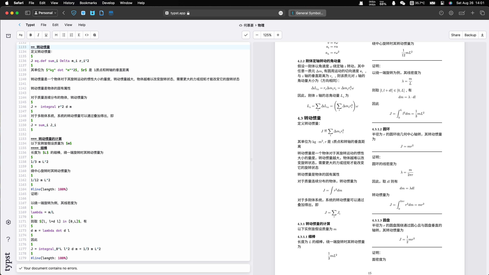
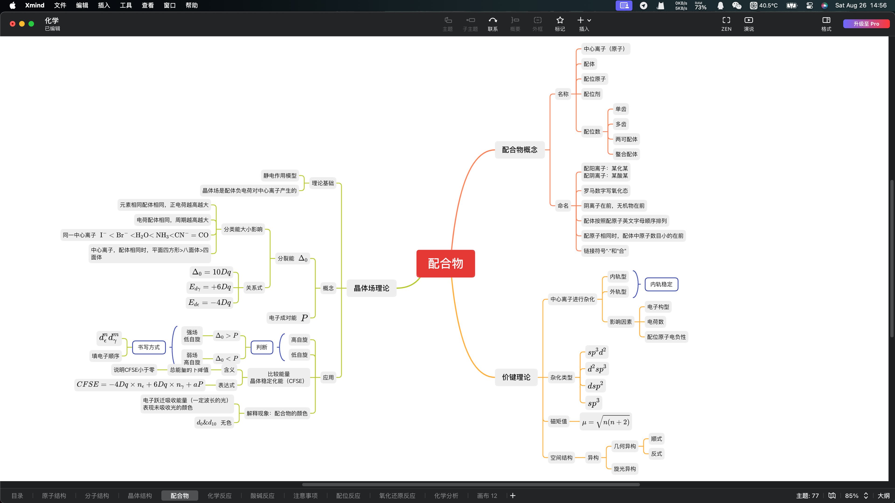
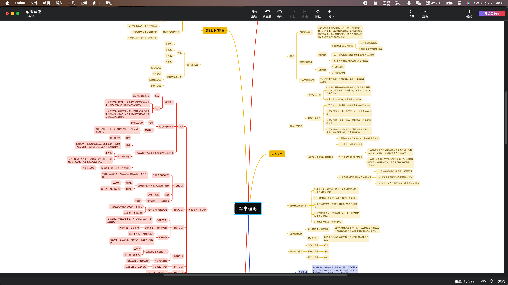
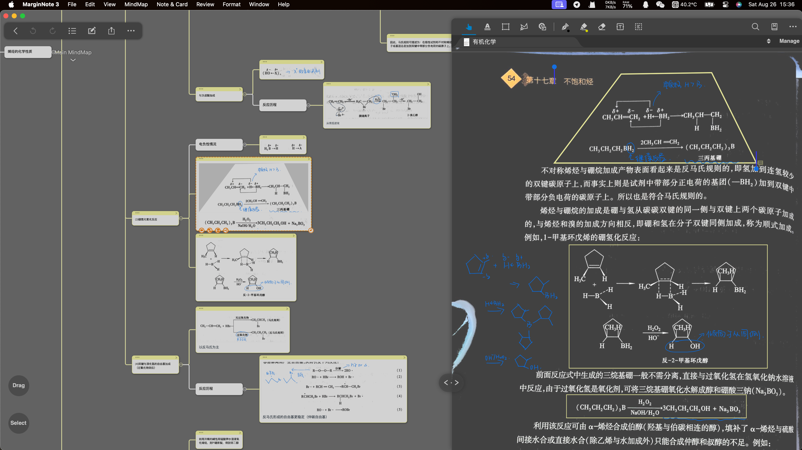

笔记是我们极为熟悉的信息记录方式。在进入大学之前，我们多数时候都会采用纸质的形式来做笔记。进入了大学，我更推荐使用电子化笔记。电子化笔记有以下的**优点**：

1. **搜索功能**：可以快速搜索关键词，方便查找信息。
2. **便携性**：可以在多个设备（如手机、平板、电脑）上访问和编辑同一份笔记。
3. **空间效率**：储存大量笔记不需实际空间，而且不容易丢失。
4. **编辑与整理**：容易修改、重组和整理信息。
5. **云同步**：可以备份并同步到云端，减少丢失风险。
6. **多媒体**：能够插入图片、音频、视频等多种形式的信息。
7. **分享与协作**：可以方便地分享给他人，并进行多人协作编辑。

同时，也有以下的缺点：

1. **电源依赖**：设备电池耗尽或没有电源时可能无法记录或查看笔记。
2. **易分心**：在电子设备上更容易受到其他应用或通知的打扰。
3. **数据丢失风险**：虽然不常见，但有可能因为技术故障或软件问题导致数据丢失。
4. **视觉疲劳**：长时间使用屏幕可能导致视觉疲劳。

但从长远来看，电子笔记的利大于弊，因此，我极力推荐电子笔记的使用。

电子笔记又包括两种类型，第一是**通过手写记录**，这种方式可以借助平板+手写笔实现，可以方便的记录公式、化学方程、进行排版，但不利于修改、重组和整理信息，以及协作编辑。第二种是**通过电脑打字录入**，这种方式便于修改、重组和整理信息，以及协作编辑，但不利于排版以及特殊符号的输入（包括数学表达式、化学方程等）。下文根据上述两种类型进行软件分类。

# 手写

**Notability**：ios, macOS, 支持iCloud同步/网盘备份

官网：[notability.com](https://notability.com)

下载：[App Store](https://apps.apple.com/cn/app/notability-note-taking/id360593530?l=en-GB)

**Goodnotes**: ios, macOS, Windows, Android, 支持iCloud同步/网盘备份/本地备份

官网：[goodnotes.com](https://www.goodnotes.com)

下载：[App Store](https://apps.apple.com/cn/app/goodnotes-6/id1444383602?l=en-GB), [Windows](https://www.goodnotes.com/windows), [Android](https://www.goodnotes.com/android)

以上两个APP特点包括   ：

1. 手写与输入可以存在于同一页：方程式、图表、列表，随心记录在同一页上
2. 标注 PDF 文件：无论是课堂讲义、练习内容，都可轻松书写
3. 支持搜索：可以搜索手写笔记、键入文本、PDF文本、文档大纲、文件夹标题和文档标题
4. 可以在记笔记的同时录音
5. 导入导出文件：支持导入pdf，导出pdf

总的来说上面两个APP没有什么特别大的区别，主要是写字手感的不同。两个APP皆为订阅制服务（之前有买断），建议先下载试用一下再决定使用哪个。

**FreeForm**: ios, macOS, 免费，支持iCloud同步

FreeForm是苹果开发的多人协作白板，为用户提供了几乎无限大的平面进行书写。很适合需要进行横行对比的科目。

下载：[App Store](https://apps.apple.com/cn/app/freeform/id6443742539?l=en-GB)

以下是利用FreeForm进行植物生物学笔记记录的实例：



除此以外，FreeForm还适合用作思路记录/草稿：



FreeForm拥有以下优点：

1. 支持无限大平面
2. 支持手写与打字同时输入
3. 支持插入图片
4. 支持PDF导出
5. 支持多人协作

同时拥有以下缺点：

1. 性能问题，过度使用后在移动端设备上会卡顿
2. 文件管理系统较为粗糙，不能进行分类

# 录入

录入的最基本方式是Word文档，但是不推荐，有如下原因：

1. 具有丰富的界面和多种功能，但对于简单的文档编辑，其界面可能显得**过于复杂**
2. 虽然允许用户进行多种格式调整，但在**微调格式和保持全文一致性**方面存在挑战
3. word文档格式(.docx)只能在**特定的软件打开**，且有多个版本，不是所有版本都提供相同的功能
4. 难以处理**复杂数学公式与排版**
5. 当包含多个媒体与图像时，文件可能较大

因此，接下来推荐三种录入的方式。

## 1. Markdown

Markdown是一种轻量级标记**语言/语法**（而非软件），它允许人们使用易读易写的纯文本格式编写文档，然后转换为有格式的文本文档。例如，上面👆的标题“录入”，在Markdown中属于一号标题，但不需要像Word文档中进行手动调整，只需要输入```# 录入``` 即可以显示为一号标题

下面是一个利用Markdown记统计学笔记的实际例子，其中左边是经过渲染后呈现的笔记，而右边则是Markdown的源代码。**可以看出，Markdown允许使用者在专注于内容创作，而非注重于排版。**



本项目即是采用Markdown语言编写而成，同时Markdown语法也被很多平台支持，例如本项目使用的Github与GitBook。

如果您希望了解更多Markdown的内容，请点击[这里](https://markdown.com.cn)

如果您希望线上体验Markdown文档的输入，请点击[这里](https://markdown.com.cn/editor/)

Markdown的**优点**有：

1. 注重文字输入，减少排版干扰
2. 纯文本，易读易写
3. 语法简单，没有什么学习成本，能轻松在码字的同时做出美观大方的排版
4. Markdown文件可移植。如果不喜欢当前使用的 Markdown 软件，则可以将 Markdown 文件导入另一个 Markdown 软件中
5. Markdown文件不受平台限制，在任何设备上都可以使用
6. 支持Latex语法的公式输入，因此便捷地支持复杂数学公式的输入

Markdown的**缺点**有：

1. 不能进行复杂的排版，例如进行复杂的图片排版
2. 不能进行便捷快速的文献引用
3. 图片必须独立保存于本地或云端，不同于Word文档可以将图片保存在文档中，Markdown只能通过路径引用图片

**Typora**: macOS, Windows, Linux, 89元买断

官网：[typoraio.cn](https://typoraio.cn)

Typora是一款支持Markdown输入的软件，拥有以下**优点**：

1. 多种主题
2. 实时预览，不需要面对上文的源代码界面
3. 支持目录大纲，文件管理
4. 支持导出为PDF, Word, HTML
5. 支持Markdown语法的同时，支持像Word文档那样手动调整

同时，拥有以下**缺点**：

1. 文件保存于本地
2. 文件储存于文件夹中，文件之间相互独立
3. 笔记较大时可能出现卡顿

**Notion**: macOS, Windows, Linux, ios, Android, 网页； 免费、部分功能订阅，学生优惠

官网：[notion.so](https://www.notion.so)

Notion是一款支持Markdown语言的，可以作为个人资料库/知识库的软件。集成了任务管理、笔记记录、数据库、日历、和协作等多种功能，允许用户创建、分享和管理内容。Notion相较于其他软件，最有特色的功能是**数据库的建立**；数据库支持内置的表格、看板、日历和列表视图，允许用户按需进行数据管理和组织。

下面是一个利用数据库进行文献阅读笔记管理的实例。其中左边是利用Notion表格建立起的数据库，每一行代表了一篇文献阅读的笔记，点击标题可以查看笔记的详细内容（如右侧所示）



这样做可以简要 记录/查看 文献的主要 内容/要点，同时方便进行横行对比，以及对不同文献主题的分类与检索。

Notion的**优点**有：

1. 数据储存与云端，在任何平台包括网页皆可以浏览
2. 支持利用数据库管理笔记，可以做到笔记之间的相互关联/嵌套
3. 拥有丰富的模版，也可以自定义模版
4. 可以使用生成式AI帮助创造（需要订阅）
5. 支持Markdown语言，且图片不需要保存在本地
6. 支持导出为PDF，HTML，Markdown；支持本地备份（笔记全部导出，图片本地保存）
7. 支持记录笔记编辑历史
8. 支持多人协作
9. 支持Markdown语法

同时，**缺点**有：

1. 数据云端储存，无网络环境时可能无法查看/修改
2. 在中国大陆没有提供服务，意味着网络可能不稳定
3. 有些服务需要订阅，但提供学生优惠（部分免费）
4. Markdown语法与官方的有一些不同，有一些操作缺少快捷键

## 2. $\LaTeX$

Markdown的缺点是**无法进行复杂的排版以及不能进行复杂的文献引用**，这对于论文撰写是致命的。因此，当进行复杂文档编辑/笔记撰写时，推荐$\LaTeX$语法。$\LaTeX$是一个高质量的排版系统，允许用户专注于他们正在编写的内容，而排版则可以通过模版等方式实现。

除此以外，值得注意的是$\LaTeX$对数学公式与特殊符号有较好的支持，数学公式的语法也可以在Markdown中使用。

下面是一个利用$\LaTeX$完成动物生物学实验报告的实例，左边是其源代码，右边是编译后呈现的结果：



如果您需要了解更多有关$\LaTeX$的知识，可以阅读[【LaTeX】新手教程：从入门到日常使用-知乎](https://zhuanlan.zhihu.com/p/456055339)

$\LaTeX$有以下**优点**：

1. 可以进行复杂排版，且经过微调后排版也能保持一致性
2. 拥有大量模版、范例参考，通常是期刊杂志接受投稿的一种格式
3. 拥有广泛的第三方插件支持（package）
4. 网络上教程较为完善
5. 可以方便的进行文献引用
6. 直接输出PDF文件
7. 可以利用代码进行画图等复杂操作

同时，有以下**缺点**：

1. 语法过于复杂、繁琐
2. 对中文的支持不是很好，有些时候容易出现bug
3. 不能实时编译显示，输入了源代码后必须手动按编译按钮，才能显示更新后的文档
4. 当文档较大时编译速度慢（受电脑性能影响）
5. 错误消息不明确，难以debug
6. 难以/无法输出为Word格式

**VScode**: macOS, Windows, Linux, 免费

官网：[code.visualstudio.com](https://code.visualstudio.com)

VScode是开发的代码编辑软件，通过第三方插件，可以对$\LaTeX$语法与编译进行支持。上文的范例中，即是使用VScode进行$\LaTeX$的使用。

同时，VScode也支持Markdown的使用与编译。

教程：[Visual Studio Code (vscode)配置LaTeX-知乎](https://zhuanlan.zhihu.com/p/166523064)

## 3. Typst

$\LaTeX$在复杂排版、文献引用、数学公式等复杂功能方面极为优秀，但**复杂的语法、对中文支持的不完善以及老旧的代码**却让人望而却步。因此，接下来介绍一种新兴的，复杂度介于Markdown与$\LaTeX$之间的语法：Typst.

Typst是一种新的基于标记的排版系统，旨在与LaTeX一样强大，同时更易于学习和使用。Typset支持本地安装使用，同时也支持网页端，且网页端拥有云同步的功能。Tyset在保留$\LaTeX$优点的同时，解决了$\LaTeX$存在的**严重缺点**，例如语法复杂，不能实时编译显示，编译速度慢，错误消息不明确等。同时Typst是一个日益更新的，拥有良好社区支持的语法。

官网（网页端使用Typst）：[typst.app](https://typst.app)

GitHub页面：[github.com/typst](https://github.com/typst/typst)

以下是利用Typst记录物理笔记的实例，其中左边为源代码，右边为渲染后的笔记。



Typst拥有以下**优点**：

1. 支持云端和本地使用
2. 可以进行复杂排版，文献引用；且微调排版可以保持一致性
3. 编译速度快，可以实时编译显示
4. 错误消息友好，方便debug
5. 良好的社区支持（Discord群组，GitHub Issue）
6. 直接输出PDF
7. 语法简单，容易上手
8. 中文支持较好
9. 支持多人协作
10. 拥有模版/自定义模版

同时，拥有以下**缺点**：

1. 缺少第三方插件（package）支持
2. 日益更新，意味着某些地方在更新后可能无法正常编译
3. 目前不是期刊杂志的主流投稿语言

# 思维导图

思维导图是一种图形化的表示方法，可以帮助用户结构化和组织大量的信息，使其更加有序和清晰。思维导图适合用于整理、记忆知识点。

**Xmind**: macOS, Windows, Linux, ios, Android，部分功能免费，完整功能订阅制，教育优惠

官网：[xmind.cn](https://xmind.cn)

下载：[xmind.cn/download](https://xmind.cn/download/)

以下是利用Xmind进行化学知识点梳理的实例：



思维导图非常适合用于考点的背诵，以下是利用Xmind进行军事理论考点背诵的实例：



Xmind有以下**优点**：

1. 支持多种图形，包括思维导图/逻辑图/括号图/组织结构图/鱼骨图/时间轴/树形图/树型表格/矩阵图
2. 拥有多种模版、色彩搭配
3. 支持数学方程/Latex
4. 支持导出为PDF、PNG、Word、Markdown
5. 在一个文件中可以包括多个思维导图

**缺点**：

1. 贵，教育优惠后291一年

**MarginNote 3**：macOS, ios；ios版买断88，mac版买断298

官网：[marginnote.com](https://www.marginnote.com)

下载：[App Store](https://apps.apple.com/cn/app/marginnote-3/id1423522373?l=en-GB&mt=12)

MarginNote 3是一款阅读器软件，其特色是可以导入PDF文件，对PDF文件进行勾画、批注，并将勾画的内容生成卡片/笔记，作为思维导图的一部分。并且在思维导图中点击卡片，即可跳转到PDF文件对应的勾画处，反之亦然。

以下是利用MarginNote 3进行有机化学教材阅读，并生成思维导图的实例：



MarginNote 3有以下**优点**：

1. 可以配合教材使用，生成思维导图
2. 支持手写批注、打字录入
3. 支持iCloud云同步
4. 支持OCR识别（需要订阅服务），全局检索

同时，有以下**缺点**：

1. 只适合PDF批注，不适合独立笔记的记录
2. 生成的思维导图没有Xmind那样成熟、方便

# 总结

|     软件     |    平台     |              价格               |   语言    |          特点          | 排版复杂度 | 排版便捷度 | 使用范例                             |
| :----------: | :---------: | :-----------------------------: | :-------: | :--------------------: | :--------: | :--------: | :----------------------------------- |
|  Notability  |    Apple    |             83/year             | 手写+打字 |          录音          |    5/5     |    5/5     | 笔记记录                             |
|  GoodNotes   |   全平台    | GN 5: 68买断<br />GN 6: 40/year | 手写+打字 | 录音（6支持，5不支持） |    5/5     |    5/5     | 笔记记录                             |
|   FreeForm   |    Apple    |              免费               | 手写+打字 |       无限大平面       |    5/5     |    5/5     | 笔记记录/草稿/思路整理               |
|    Typora    |   全平台    |             89买断              | Markdown  |    Markdown实时显示    |   无排版   |   无排版   | 笔记记录                             |
|    Notion    | 全平台+网页 |      学生免费，AI功能订阅       | Markdown  |       资源库整理       |   无排版   |   无排版   | 笔记记录/资料库整理/文献阅读笔记整理 |
|    Latex     |   全平台    |              免费               |   Latex   | 文献引用/排版/论文投稿 |    5/5     |    1/5     | 论文写作/笔记记录                    |
|    Typst     | 全平台+网页 |              免费               |   Typst   |  类Latex但复杂度降低   |    5/5     |    3/5     | 笔记记录/论文写作                    |
|    Xmind     |   全平台    |          学生291/year           |   打字    |        思维导图        |    2/5     |    5/5     | 知识点背诵/整理                      |
| MarginNote 3 |    Apple    |      ios88买断，mac298买断      | 手写+打字 |     配合教科书使用     |    2/5     |    5/5     | 教科书批注/勾画                      |

