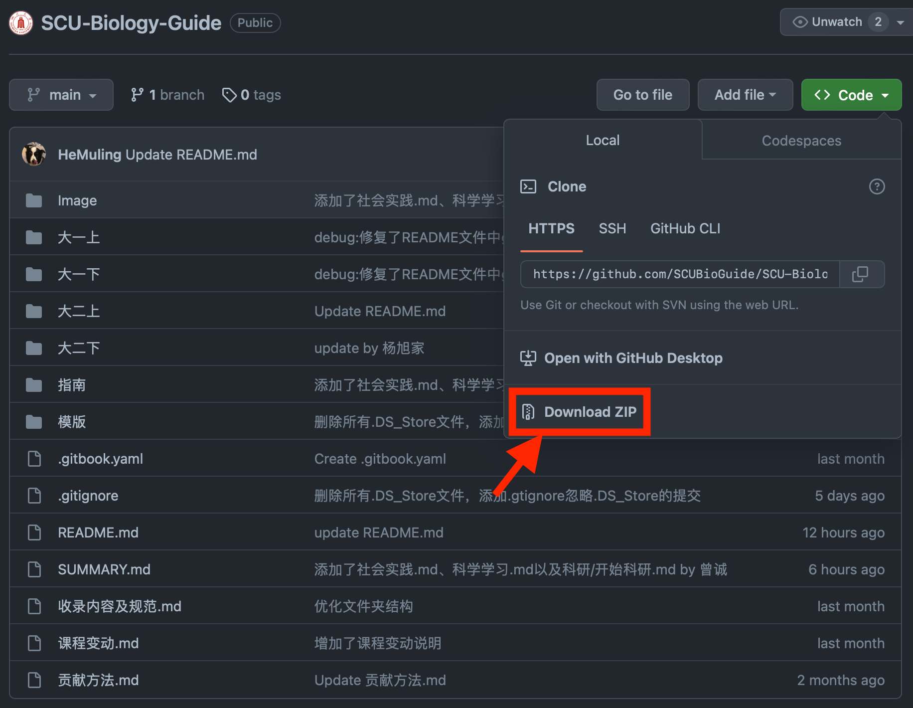

本项目基于Github仓库，以GitBook形式推出。

本项目支持手机及电脑网页端访问，推荐使用电脑访问。

# 项目访问

本项目支持Github网页访问或Gitbook访问

## Gitbook

### 电脑

左侧时本项目的结构，点击标题可以跳转到对于的页面。

右侧是本页面的大纲，点击标题支持跳转到对应的部分。

右上方是搜索页面，支持对于关键词的搜索。

每一个页面的最下方拥有评分选项，同时欢迎各位同学给予意见与建议。

### 手机

点击左上方可以展开本项目的结构。

点击右上方可以进行搜索。

## Github

如果觉得我们有用，请给我们一个[star](https://github.com/SCUBioGuide/SCU-Biology-Guide/stargazers)，虽然没有什么用，但是看起来很爽

# 项目下载

此项目较大，推荐使用网盘下载

## 网盘下载

本项目克隆至阿里云盘，下载地址：[点这里](https://www.aliyundrive.com/s/BpDzetteS7m)，请下载最新日期的文件

## Github

如果您在[Github网页](https://github.com/SCUBioGuide/SCU-Biology-Guide/tree/main)下载，请点击：



如果您在使用Git下载，

对于Windows系统，请Win键+R，输入cmd，

对于macOS系统，请打开terminal/终端

运行以下命令

```
git clone https://github.com/SCUBioGuide/SCU-Biology-Guide.git
```

如果下载速度慢，则运行

```
git config --global url."https://gitclone.com/".insteadOf https://
git clone https://github.com/SCUBioGuide/SCU-Biology-Guide.git
```

